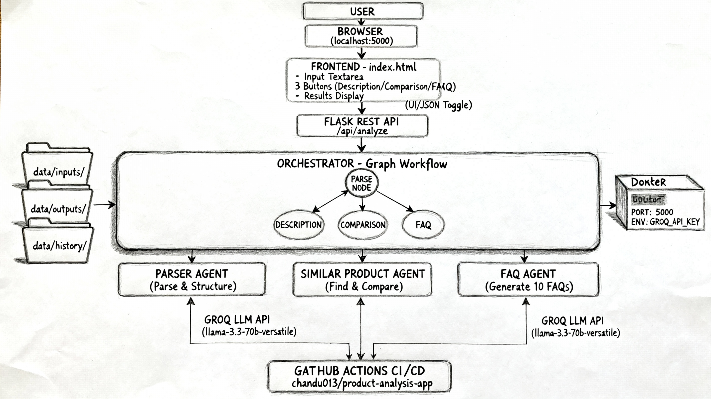

# 🤖 Multi-Agent Product Analysis System


    Running application : https://product-analysis-app-latest.onrender.com


A powerful AI-driven product analysis platform using multi-agent architecture with LangGraph-style orchestration and Groq LLM integration.



## 📸 Application Preview


## 🌟 Features

- **Multi-Agent Architecture**: Three specialized agents working in orchestrated workflow
  - **Parser Agent**: Extracts and structures product data
  - **Similar Product Agent**: Finds and compares market alternatives
  - **FAQ Agent**: Generates 10 detailed frequently asked questions

- **Graph-Based Orchestration**: LangGraph-inspired node execution with dynamic routing

- **Dual Output Modes**: 
  - Beautiful UI with side-by-side comparison cards
  - JSON output for technical inspection

- **Real-time Analysis**: Uses Groq's latest LLM (llama-3.3-70b-versatile) for accurate results

- **Data Persistence**: Automatic storage of inputs, outputs, and execution history

## 🏗️ System Architecture


## 🚀 Quick Start with Docker

### Prerequisites
- Docker installed on your system
- Groq API Key ([Get it here](#getting-groq-api-key))

### Pull and Run


### Access the Application

Open your browser and navigate to:
http://localhost:5000


## 🔑 Getting Groq API Key

1. Visit [Groq Console](https://console.groq.com/)
2. Sign up for a free account
3. Navigate to **API Keys** section
4. Click **Create API Key**
5. Copy your key (format: `gsk_...`)
6. Use it in the docker run command

## 💻 Local Development Setup

### 1. Clone the Repository


git clone https://github.com/yourusername/product-analysis-app.git
cd product-analysis-app### 2. Install Dependencies

pip install -r requirements.txt


### 3. Set Environment Variable

**Linux/Mac:**
export GROQ_API_KEY="your_groq_api_key_here"


## 🎯 Usage

### 1. Input Your Product Data

Enter product information in JSON format or plain text:

**JSON Format:**


## 🚢 CI/CD Pipeline

This project includes GitHub Actions workflow for automated testing and deployment.

Triggers on: push to main/master, pull requests

Actions: Install dependencies, run tests, pull Docker image

## 🛠️ Tech Stack

- **Backend**: Flask, Python 3.11
- **Frontend**: HTML5, CSS3, Vanilla JavaScript
- **LLM**: Groq (llama-3.3-70b-versatile)
- **Orchestration**: Custom Graph-based Agent Workflow
- **Containerization**: Docker
- **CI/CD**: GitHub Actions

## 📝 API Endpoints

### POST `/api/analyze`

Analyzes product data using specified operation.

**Request:**

## 🤝 Contributing

Contributions are welcome! Please follow these steps:

1. Fork the repository
2. Create a feature branch (`git checkout -b feature/AmazingFeature`)
3. Commit changes (`git commit -m 'Add AmazingFeature'`)
4. Push to branch (`git push origin feature/AmazingFeature`)
5. Open a Pull Request

## 📄 License

This project is licensed under the MIT License - see the LICENSE file for details.

## 👨‍💻 Author

**Chandu**
- Docker Hub: [chandu013](https://hub.docker.com/u/chandu013)

## 🙏 Acknowledgments

- [Groq](https://groq.com/) for lightning-fast LLM inference
- [Flask](https://flask.palletsprojects.com/) for the web framework
- [LangGraph](https://github.com/langchain-ai/langgraph) for agent orchestration inspiration

## 📞 Support

For issues and questions, open an Issue on GitHub

## 🔄 Version History

- **v1.0.0** (December 2025)
  - Initial release
  - Multi-agent architecture
  - Docker support
  - CI/CD pipeline

---

⭐ **Star this repository if you find it helpful!**

Made with ❤️ using AI-powered multi-agent systems

## 🚀 Run with Docker

### 1️⃣ Pull the Image
```bash
docker pull chandu013/product-analysis-app:latest
GROQ_API_KEY=your_groq_api_key_here
docker run -it --env-file .env -p 5000:5000 chandu013/product-analysis-app
http://localhost:5000

That’s it. ✅  
If you want a **full README** or **Docker Hub README version**, tell me.


